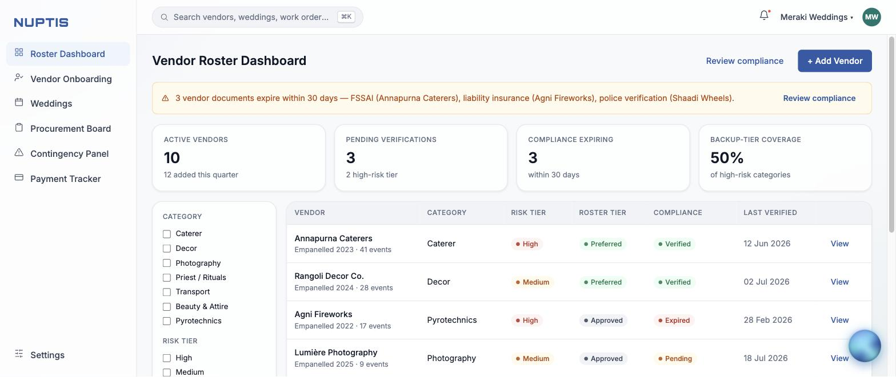
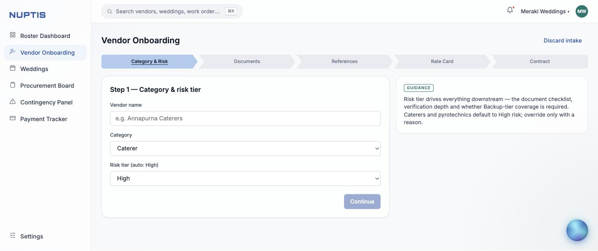
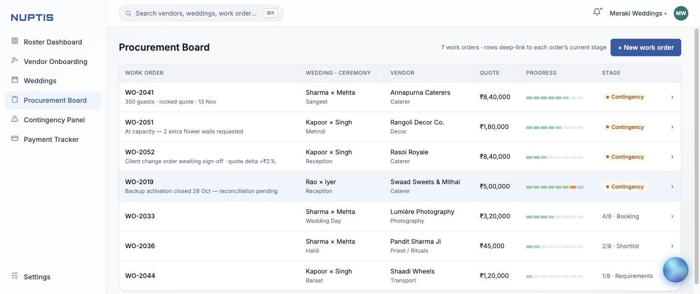
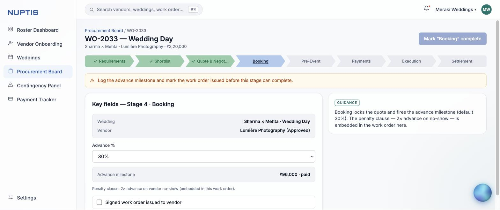
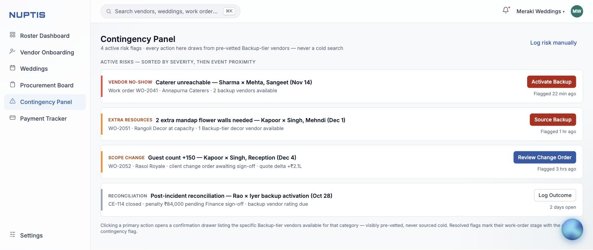
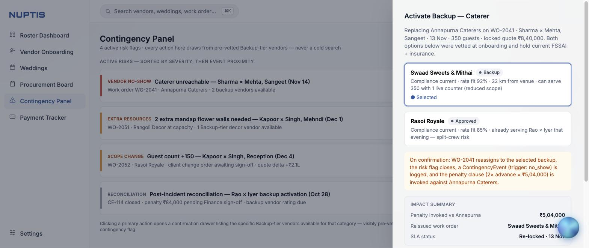
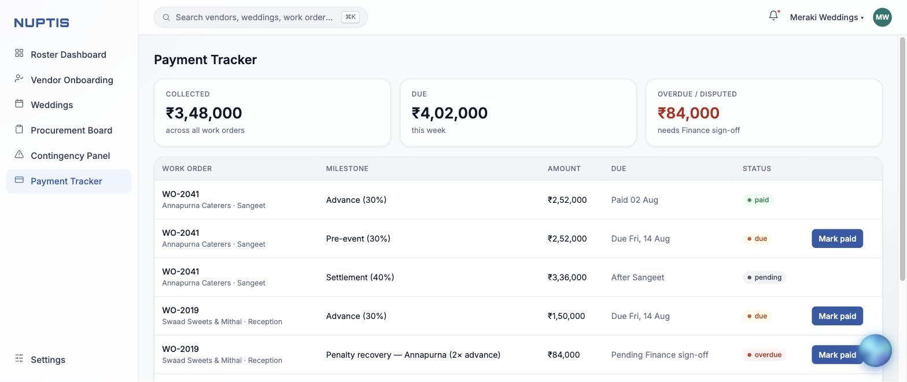
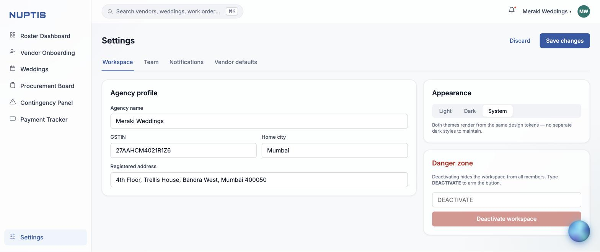

<p align="center">
  
</p>

<p align="center"><strong>Vendor onboarding & procurement ops for wedding-planning agencies.</strong></p>
<p align="center">Onboard vendors once with risk-tiered vetting, keep a pre-vetted backup tier, and make day-of contingency recovery a single click — penalties and SLAs included.</p>

<p align="center">
  
  
  
</p>

---

**Nuptis** is a working SaaS front-end for the people who run weddings for a living. An agency juggles dozens of vendors — caterers, decor, pyrotechnics, priests, transport — across parallel ceremonies, and when one fails on the day, trust usually resets to zero and someone starts cold-calling. Nuptis's bet: **vet once, keep a Backup tier warm, and turn a no-show into a one-click reassignment** that reissues the work order, fires the penalty clause, and re-locks the SLA. It runs standalone from `localStorage` with a seeded demo dataset, or against a real Supabase/Postgres backend — the same screens, no code branches.

## Highlights

- **Vendor Roster Dashboard** — live KPIs (backup-tier coverage is *computed*, not hardcoded), an expiring-documents compliance banner, and category / risk-tier / roster-tier filters over the vendor table.
- **Risk-tiered onboarding** — a 5-step chevron wizard (Category & Risk → Documents → References → Rate Card → Contract) where the risk tier drives the required-document checklist; publishing adds the vendor to the roster.
- **Procurement Board** — every work order on an 8-segment mini-stepper, each row deep-linking straight to that order's live stage.
- **8-stage work-order path** — a Salesforce-Path-style stepper (Requirements → Shortlist → Quote → Booking → Pre-Event → Payments → Execution → Settlement) with per-stage guidance and completion gates.
- **Contingency Panel** ⚑ — the flagship. Four trigger types (no-show / extra resources / scope change / reconciliation), each opening a confirmation drawer of *pre-vetted* Backup-tier vendors. Confirming **actually mutates state**: the work order reassigns, a penalty milestone appears, the risk flag resolves, and the order's stage gets an amber flag.
- **Payment Tracker** — a milestone ledger with computed collected / due / overdue KPIs, mark-paid, and penalty-recovery rows created by contingency activations.
- **Two backends, one UI** — offline `localStorage` demo by default; add Supabase env vars and every business action mirrors to Postgres through four atomic functions.
- **Design tokens, light & dark** — one token set (`tokens.css`) drives both themes via `[data-theme]`, ported 1:1 from the Figma variable modes. No UI framework — ~28 KB of purpose-built CSS.
- **Global layer** — ⌘K search across vendors / weddings / work orders, a notifications panel with deep links, a toast system, and the rotating **aurora orb** that opens the Nuptis Assistant.

## Screenshots

### Vendor Roster Dashboard — live KPIs, compliance banner, filterable roster


### Vendor Onboarding — the risk-tiered 5-step intake wizard


### Procurement Board — every work order with its 8-segment progress


### Stage view — the Salesforce-Path 8-stage stepper with per-stage guidance


### Contingency Panel — four risk triggers, each drawing on pre-vetted backups


### Activate Backup — the confirmation drawer that reassigns, penalizes, and re-locks


### Payment Tracker — milestone ledger with computed collected / due / overdue


### Settings — workspace, team, appearance, and a typed-confirmation danger zone


## Getting started

> Prerequisite: [Node.js](https://nodejs.org) 18+.

```bash
npm install
npm run dev        # http://localhost:5173
```

**Offline demo (default, no setup)** — sign in with any valid email and a 4+ character password to enter as the workspace Owner. Data is seeded and persisted to `localStorage`; **Profile → Reset demo data** restores the original dataset.

**Supabase-backed (optional)** — create `.env.local` in the repo root (gitignored) and Login switches to real email/password auth, with every action mirrored to Postgres:

```bash
VITE_SUPABASE_URL=https://xxxx.supabase.co
VITE_SUPABASE_ANON_KEY=eyJ...
```

Then paste [`supabase/schema.sql`](supabase/schema.sql) into the Supabase SQL Editor — it creates the tables, Row Level Security policies, the seed dataset, and the four contingency functions (`activate_backup`, `source_backup`, `approve_change_order`, `log_outcome`).

```bash
npm run build      # tsc typecheck + vite build -> dist/
npm run preview    # serve the production build locally
```

The build uses `HashRouter`, so the static `dist/` folder runs from any host — or straight off `file://` — with zero server config.

## How it works

- **Offline-first storage.** With no env vars the app runs entirely on `localStorage` against the seed data; when `VITE_SUPABASE_URL` + `VITE_SUPABASE_ANON_KEY` are present, `isSupabaseConfigured` flips the same UI onto Postgres — no branching inside the screens.
- **The reducer is the API surface.** Every business action (`ACTIVATE_BACKUP`, `SOURCE_BACKUP`, `APPROVE_CO`, `LOG_OUTCOME`, `ADVANCE_STAGE`, …) is one reducer case in `store.tsx`. Dispatch is optimistic locally, then mirrored to the matching atomic Postgres function; swapping the backend means implementing those actions server-side, not touching the UI.
- **Tokens over hardcoding.** Every color flows through the CSS custom properties in `styles/tokens.css`, so light/dark parity is structural — the same guarantee the Figma file makes with its variable modes.
- **No UI framework.** The dependency tree is just React, React Router, and the Supabase client; the design system is implemented directly as ~28 KB of hand-written CSS.

## Development

```bash
npm run dev        # Vite dev server with HMR
npm run build      # tsc typecheck (tsc && vite build) + production bundle
npm run preview    # preview the built bundle
```

Type-checking runs as the first half of `npm run build` (`tsc`). There is no separate lint or unit-test script configured in this project.

```
src/
  types.ts        domain model (Vendor, WorkOrder, Flag, Milestone, …)
  seed.ts         demo dataset — mirrors the Figma mockup's content 1:1
  store.tsx       React context + reducer; one case per business action
  lib/            supabase.ts (client + isSupabaseConfigured), cloud.ts (row<->type + atomic fns)
  styles/         tokens.css (light/dark tokens) + app.css (components, glass, steppers, aurora orb)
  components/     Shell, Stepper, Assistant, ui kit
  screens/        one file per screen
```

## Credits & license

Built 1:1 from the **NuptisV2 Figma design system** ([figma.com/design/2hvOt6R9g9iseQxHXTDRpv/NuptisV2](https://www.figma.com/design/2hvOt6R9g9iseQxHXTDRpv/NuptisV2)) as a Case Study grounding exercise: process doc → PRD → Figma prototype → this code. The seed data (Annapurna Caterers, WO-2041, the ₹5,04,000 penalty…) is the mockup's own narrative, kept intact so the prototype and the product tell the same story.

No license file is included — this is a portfolio / case-study project; please ask before reuse.
